# CareerOps Agent Engine

[](https://github.com/ha7n23/careerops-agent-engine/actions/workflows/ci.yml)

**Stateful, evidence-grounded AI backend for analysing jobs, matching approved career evidence, reviewing CV changes, and generating verified DOCX/PDF CV versions.**

CareerOps Agent Engine is a portfolio-grade AI engineering project built around a simple rule: **LLMs can reason and propose, but trusted state changes must be grounded, validated, persisted, and human-approved.** It combines LangGraph, LangChain, LangSmith, provider-neutral LLM adapters supporting Google Gemini and Groq, FastAPI, PostgreSQL, deterministic document processing, Docker, and CI into one durable workflow.

## 30-second summary

- **CV evidence pipeline:** securely ingest PDF/DOCX CVs, extract structured evidence proposals, detect overlaps, and require explicit human approval before evidence enters the trusted registry.
- **Job-analysis graph:** extract requirements, use a bounded tool-calling agent to discover approved evidence, calculate a deterministic fit score, generate grounded CV proposals, verify factual claims, and pause for human review.
- **Verified document output:** apply accepted changes to a structured CV, create an immutable version, render an ATS-friendly DOCX, convert it to PDF with LibreOffice, and deterministically verify both artifacts before download.
- **Production-style engineering:** PostgreSQL persistence and LangGraph checkpoints, LangSmith tracing/evaluation with privacy masking, FastAPI security boundaries, Dockerised runtime, Alembic migrations, and GitHub Actions container integration.
- **Current quality baseline:** **440 passing tests**, **9 opt-in live integration tests skipped by default**, Ruff clean, and strict mypy checks across **149 source files**.

> For the deeper design, trust boundaries, workflow states, persistence model, and trade-offs, see [Architecture](docs/ARCHITECTURE.md).

## Why this project exists

A CV-tailoring assistant is easy to prototype and difficult to make trustworthy. A useful system must deal with hallucinated experience, unverified claims, interrupted workflows, retries, document provenance, user isolation, and generated files that may not match the accepted source state.

CareerOps treats those as engineering problems rather than prompt-only problems:

- **Approved evidence is the source of truth.** The agent searches a user-scoped evidence registry instead of inventing experience.
- **Agentic reasoning is bounded.** Model calls, tool calls, search calls, and graph recursion are explicitly limited.
- **Critical decisions stay deterministic.** Fit scoring, evidence validation, review validation, versioning, artifact integrity checks, and document verification are implemented in code.
- **Human review is a real workflow boundary.** Verified proposals can be approved or rejected individually in one decision, and the accepted subset completes without another model call. Human-edited wording is re-verified, while regenerated wording returns to review rather than auto-approving itself.
- **State survives process restarts.** Business audit records live in PostgreSQL and LangGraph uses PostgreSQL-backed checkpoints for resumable execution.

## End-to-end flow

```mermaid
flowchart LR
    CV[PDF / DOCX CV] --> Upload[Secure upload validation]
    Upload --> Extract[Native extraction + section parsing]
    Extract --> EvidenceLLM[Structured evidence proposals]
    EvidenceLLM --> EvidenceReview{Human evidence review}
    EvidenceReview -->|approve| Registry[(Approved Evidence Registry)]

    JD[Job description] --> Requirements[Structured requirement extraction]
    Requirements --> Agent[Bounded evidence-discovery agent]
    Registry --> Agent
    Agent --> Fit[Deterministic fit score]
    Fit --> Proposal[Grounded CV proposal generation]
    Proposal --> Verify[Claim verification]
    Verify --> CVReview{Human CV review}
    CVReview -->|approve / edit| Assemble[Deterministic CV assembly]
    CVReview -->|regenerate| Proposal

    Assemble --> Version[(Immutable CV version)]
    Version --> DOCX[Render + verify DOCX]
    DOCX --> PDF[LibreOffice conversion + verify PDF]
    PDF --> Artifacts[Verified downloadable artifacts]
```



## Engineering highlights

| Area | Implementation |
| --- | --- |
| Orchestration | LangGraph state graph with conditional routing, interrupts, retries through durable checkpoints, and explicit review branches |
| Agentic AI | LangChain tool-calling evidence agent restricted to approved user-scoped evidence, with model/tool/search/recursion limits |
| Structured LLM outputs | Pydantic-validated requirement extraction, evidence extraction, CV proposal generation, and claim verification |
| Trust model | Human-approved Evidence Registry; generated claims are re-verified against approved evidence before review |
| Deterministic logic | Fit scoring, review validation, duplicate/grounding checks, structured CV application, document verification, checksums |
| Persistence | PostgreSQL + SQLAlchemy + Alembic for documents, evidence, workflow snapshots, audit history, CV versions, and artifacts |
| Durable state | LangGraph `PostgresSaver` checkpointing, separate from business/audit persistence |
| Documents | Native PDF/DOCX extraction, ATS-friendly one-column DOCX rendering, LibreOffice PDF conversion, deterministic DOCX/PDF verification |
| Observability | LangSmith run metadata/tags, privacy-conscious input/output hiding, trajectory inspection, versioned evaluation datasets |
| API | FastAPI with service-key mode, user scoping, trusted-host checks, security headers, sanitized 500 responses, liveness/readiness endpoints |
| Runtime | Python 3.12, `uv`, Docker, non-root UID 10001, PostgreSQL Compose service, one-shot migrations, health checks |
| CI | GitHub Actions quality/test job plus a container integration job that builds, migrates, starts, checks readiness, and verifies non-root execution |

## Evaluation: failure-driven prompt improvement

Requirement extraction has a committed six-case synthetic benchmark covering essential/desirable classification, anti-hallucination behaviour, prompt-injection resistance, semantic deduplication, source grounding, and missing-role-title handling.

The LangSmith experiment history is intentionally preserved as an engineering record:

| Prompt | Result | Decision |
| --- | --- | --- |
| `job-requirements-v1` | **5/6 passed**, average deterministic score **0.97** | Baseline; failed semantic deduplication |
| `job-requirements-v2` | Regressed on previously passing cases | Rejected rather than weakening the evaluator |
| `job-requirements-v3` | **6/6 passed with perfect deterministic scores** | Accepted current prompt |

Each example is scored on role-title correctness, requirement count, forbidden-term absence, source grounding, and expected-requirement accuracy. Dataset/model/prompt/temperature provenance is recorded, and the Git-managed dataset is synchronized to LangSmith with a content SHA-256. LangSmith inputs and outputs are hidden by default to reduce exposure of CV/job content.

## API surface

System endpoints remain public for infrastructure health checks; business endpoints require a valid user scope and can additionally require a service credential in `service_key` mode.

| Method | Endpoint | Purpose |
| --- | --- | --- |
| `GET` | `/health` | Process-level liveness |
| `GET` | `/ready` | PostgreSQL/schema readiness |
| `POST` | `/api/v1/cv-documents` | Upload a validated PDF/DOCX CV |
| `POST` | `/api/v1/cv-documents/{document_id}/evidence-review` | Start or recover evidence review |
| `GET` | `/api/v1/cv-evidence-reviews/{review_run_id}` | Recover a persisted evidence-review run |
| `POST` | `/api/v1/cv-evidence-reviews/{review_run_id}/review` | Submit human evidence decisions |
| `POST` | `/api/v1/job-analysis` | Start durable job analysis |
| `POST` | `/api/v1/job-analysis/{thread_id}/review` | Resume paused CV review |
| `POST` | `/api/v1/cv-versions` | Generate/recover a verified final CV version |
| `GET` | `/api/v1/cv-versions/{cv_version_id}` | Read safe CV-version metadata |
| `GET` | `/api/v1/cv-versions/{cv_version_id}/artifacts/{artifact_format}` | Download verified DOCX/PDF bytes |

Interactive OpenAPI documentation is available from FastAPI at `/docs` when the service is running.

## Quick start

### Docker-first

Requirements: Docker with Compose. Groq is the default provider and requires `GROQ_API_KEY` for live workflows. Google Gemini remains supported and requires `GOOGLE_API_KEY` when selected.

```bash
cp .env.example .env
# Add the API key for your selected live LLM provider.

docker compose up --build -d
```

Compose starts PostgreSQL, runs Alembic plus LangGraph checkpoint initialization through the one-shot `migrate` service, then starts the API.

```bash
curl http://127.0.0.1:8000/health
curl http://127.0.0.1:8000/ready
```

Stop the stack:

```bash
docker compose down
```

### Local development

```bash
uv sync --locked --dev
uv run ruff format --check .
uv run ruff check .
uv run python -m mypy src
uv run pytest
```

The default Groq routing uses `openai/gpt-oss-20b` for fast structured extraction and `openai/gpt-oss-120b` for quality generation, verification, and tool-calling. Google can be selected through `CAREEROPS_LLM_PROVIDER="google"` with compatible model settings. Unset task-profile overrides fall back to `CAREEROPS_LLM_MODEL`.

For Groq fast structured extraction, temporary rate-limit or internal-server failures can trigger one model transition from the configured fast model to the quality model after the primary model’s configured retries are exhausted. Authentication, invalid-request, connection, timeout, validation, and grounding failures are not fallback conditions. Quality-generation and tool-calling paths do not downgrade or switch providers.

Live LLM-provider and LibreOffice integration tests are opt-in through `RUN_LIVE_LLM_TESTS=true` and `RUN_LIVE_DOCUMENT_TESTS=true` so the default suite stays deterministic and CI-friendly.

## Security and privacy boundaries

CareerOps is designed as an **agent-engine service**, not an identity provider. In local development, `X-User-ID` provides the user scope. In `service_key` mode, trusted callers must also provide `X-CareerOps-Service-Key`; staging/production configuration rejects development-only authentication.

Other controls include:

- byte-level PDF/DOCX detection rather than trusting filename or MIME metadata;
- upload-size limits plus DOCX archive entry/uncompressed-size limits;
- user-scoped opaque storage namespaces and traversal-resistant storage adapters;
- PostgreSQL ownership constraints and repository-level user scoping;
- `SecretStr` service credentials, trusted-host validation, security response headers, and sanitized unexpected errors;
- artifact size/SHA-256 verification before download;
- no storage keys or internal provenance identifiers in public CV metadata or visible generated documents;
- LangSmith metadata allow-listing and hidden trace inputs/outputs by default.

## Repository structure

```text
src/careerops_agent_engine/
├── agents/          # LangGraph graph, nodes, prompts, tools, state
├── api/             # FastAPI routers, schemas, auth, middleware
├── application/     # Use cases, services, ports/interfaces
├── core/            # Environment-driven configuration
├── domain/          # Strict business models and enums
├── evaluation/      # Deterministic benchmark and LangSmith integration
└── infrastructure/  # LLMs, PostgreSQL, documents, storage, observability

evals/               # Version-controlled evaluation datasets
migrations/          # Alembic business-schema migrations
scripts/             # DB setup, smoke tests, benchmark/eval utilities
tests/               # Unit, graph, integration, live LLM/document tests
```

## Current scope and deliberate boundaries

This repository focuses on the AI/backend engine. The following are intentionally outside the current scope rather than presented as completed features:

- no end-user React frontend in this repository;
- no OCR fallback for image-only/scanned CVs yet;
- one deterministic standard CV template rather than a template marketplace/editor;
- local persistent document/artifact storage behind ports, ready to be replaced by cloud object storage;
- AWS deployment is intentionally deferred until a public deployment is needed; container and CI deployment readiness are already proven.

These boundaries keep the project focused on the harder AI-engineering concerns: **agent control, evidence grounding, human approval, persistence, evaluation, safe document generation, and production-style software engineering.**

## Detailed architecture

See **[docs/architecture.md](docs/ARCHITECTURE.md)** for the graph topology, evidence trust boundary, persistence model, document pipeline, observability/evaluation design, security model, and extension points.

## Project updates


### 2026-09-24 — Batched CV generation and verification

- Reduced initial CV proposal generation from one quality-model call per eligible requirement to at most one batched call.
- Reduced initial claim verification from one quality-model call per proposal to at most one separate batched verification call.
- Added deterministic validation for exact requirement/proposal coverage, stable identifiers, response ordering, and per-item approved-evidence boundaries.
- Kept generation and verification as independent safety stages, while retaining targeted regeneration and reverification after human feedback.
- Live-validated two grounded proposals from one generation call and independent supported/unsupported decisions from one verification call.
- Added an empty Evidence Registry fast path that returns deterministic gaps for all requirements after one bounded repository check and zero evidence-agent calls.
- Reduced approved-evidence discovery from one bounded tool-calling agent run per requirement to at most one batched run per job, while preserving the zero-call empty-registry path.

### 2026-09-23 — Provider-neutral Groq routing

- Added provider-neutral Google Gemini and Groq model construction.
- Made Groq the default provider with deterministic 20B fast and 120B quality/tool routing.
- Added per-provider and per-model rate limiting.
- Added explicit tool-based structured output for Groq-compatible evidence discovery.
- Live-validated requirement extraction, CV evidence extraction, proposal generation, claim verification, tool calling, PostgreSQL persistence, and the complete job-analysis safety workflow.
- Added a bounded 20B-to-120B fallback for temporary Groq capacity failures on fast structured extraction only.

### 2026-08-25 — Integration and resilience hardening

- Switched the current MVP default LLM to `gemini-3.5-flash-lite` for more practical development throughput while keeping the provider boundary replaceable.
- Hardened bounded evidence discovery so tool-call limits stop excess calls without crashing the workflow.
- Added fail-closed handling for exhausted model-call budgets: unsupported evidence discovery now returns an explicit gap rather than propagating an HTTP 500.
- Isolated pytest configuration from developer-local authentication settings so the deterministic suite behaves consistently across environments.
- Added regression coverage for bounded evidence-discovery failure handling.
- Successfully validated authenticated service-to-service job analysis from the separate CareerOps Automation & MCP Hub over the public HTTP API.

Current quality baseline: **440 passed, 9 skipped**, Ruff clean, strict mypy clean across **149 source files**.