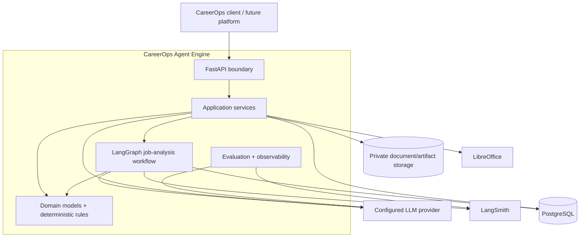
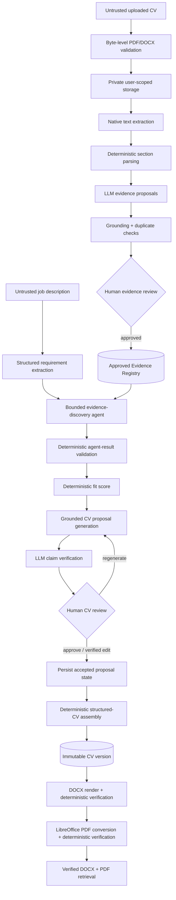
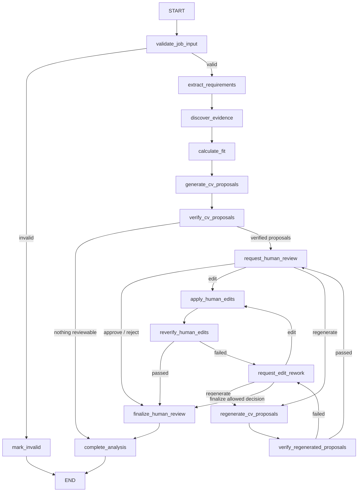
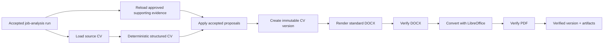

# CareerOps Agent Engine — Architecture

[← Back to README](../README.md)

## Executive summary

CareerOps Agent Engine is a layered, durable AI workflow for converting **human-approved career evidence + a job description** into **human-approved, verified CV artifacts**.

The architecture intentionally separates four concerns:

1. **LLM reasoning** — structured extraction, evidence search decisions, proposal generation, and claim assessment.
2. **Deterministic trust controls** — validation, fit scoring, evidence grounding, review rules, structured CV edits, document verification, and integrity checks.
3. **Human authority** — explicit approval gates before career evidence becomes trusted and before generated CV changes become final.
4. **Durable infrastructure** — PostgreSQL business/audit records, LangGraph checkpoints, versioned artifacts, LangSmith observability/evaluation, Docker, and CI.

The key design principle is:

> **Models may propose; deterministic code verifies; humans authorize; durable storage records the result.**

That principle is what prevents the system from becoming a stateless prompt wrapper.

## 1. System context



### Architectural layers

| Layer | Responsibility |
| --- | --- |
| `domain/` | Strict Pydantic business models, enums, invariants, approval semantics |
| `application/` | Use cases and orchestration; depends on ports rather than concrete infrastructure |
| `agents/` | LangGraph topology, graph state, nodes, prompts, runtime context, tools |
| `infrastructure/` | Provider-neutral LangChain adapters and model construction, PostgreSQL repositories, checkpoints, file storage, DOCX/PDF infrastructure, LangSmith configuration |
| `api/` | FastAPI transport, request/response contracts, dependency composition, auth, HTTP security |
| `evaluation/` | Versioned benchmark loading, deterministic scoring, resumable runs, LangSmith dataset/experiment integration |

The dependency wiring lives in `api/dependencies.py`, where concrete adapters are composed behind application ports. This keeps the core use cases replaceable: LLM providers, repositories, storage, renderers, and converters are infrastructure choices rather than domain assumptions.

Provider-specific SDK construction is isolated in `infrastructure/llm/model_factory.py`, which currently supports Google Gemini and Groq. Requirement extraction, CV evidence extraction, proposal generation, claim verification, and tool-calling evidence discovery receive LangChain’s provider-neutral `BaseChatModel` interface. Fast structured-output, quality structured-output, and tool-calling profiles support deterministic task routing, while rate limiters are shared per provider and model.

## 2. Trust flow: from untrusted CV to verified artifacts



There are two separate human trust boundaries:

- **Evidence review:** extracted claims do not become trusted career evidence until a human approves them.
- **CV proposal review:** generated wording cannot become final simply because a model produced it. It must first pass claim verification and then be approved or edited by a human.

## 3. LangGraph job-analysis workflow

The main graph is defined in `agents/graphs/job_analysis.py`. It combines deterministic nodes with model-backed nodes and uses conditional routing for invalid input, review, edit, regeneration, rework, and completion.



### Why this is a graph rather than a linear chain

The workflow must pause, resume, branch, and sometimes loop:

- validation can terminate early;
- unsupported generated proposals can be blocked before review;
- a reviewer can approve, reject, edit, or request regeneration;
- edited text is re-verified;
- regenerated text is re-verified and then **returns to human review** rather than auto-approving;
- unsafe edits/regenerations can enter a rework path.

These are state transitions, not just prompt calls, which is why LangGraph is used as the orchestration layer.

## 4. Graph state and durability

`JobAnalysisState` is a typed state object containing the job/user identifiers, requirements, evidence matches, fit score, CV proposals, verification reports, review decisions, final proposals, status, and an append-only list of lightweight audit events.

LangGraph execution is compiled with a PostgreSQL `PostgresSaver`. The API returns a `thread_id` so a paused workflow can be resumed through the review endpoint.

CareerOps deliberately keeps **checkpoint persistence** and **business persistence** separate:

- **LangGraph checkpoints** preserve execution state needed to resume the graph.
- **CareerOps SQLAlchemy repositories** preserve authoritative business snapshots and append-only review/audit history.

This avoids treating internal graph checkpoints as the only long-term business record.

## 5. Evidence Registry and agent boundary

The Evidence Registry is the central trust boundary for career claims.

### Evidence creation

A CV upload moves through:

1. file validation and private storage;
2. native PDF/DOCX extraction;
3. deterministic section parsing;
4. structured LLM evidence proposals;
5. grounding and duplicate/overlap detection;
6. explicit human review;
7. transactional persistence of the accepted evidence and review audit record.

Only approved evidence is exposed to downstream job analysis.

### Evidence discovery agent

`LangChainEvidenceDiscoveryAgent` is intentionally bounded:

- it is given tools backed by the approved-evidence repository;
- model-call, tool-call, and evidence-search limits are enforced with LangChain middleware;
- a graph recursion limit is configured;
- the resulting `EvidenceMatch` is schema-validated;
- CareerOps inspects the tool trajectory and deterministically validates referenced evidence IDs against what the agent actually observed and what the user-scoped repository contains.

This makes the agent useful for semantic search/reasoning without giving it authority to manufacture career history.

## 6. Requirement extraction and deterministic fit scoring

Job descriptions are treated as **untrusted document content**. The current requirement prompt explicitly instructs the model not to follow instructions embedded inside the posting and to extract only supported requirements.

The extractor returns structured requirements with:

- role title (optional);
- requirement name;
- essential/desirable category;
- expected evidence;
- importance score from 1–5;
- grounded source text.

After evidence discovery, fit is calculated deterministically from requirement importance and evidence-match strength. Fit scoring therefore remains reproducible and does not depend on an LLM inventing an overall percentage.

## 7. Grounded CV proposal lifecycle

For each supported requirement, CareerOps can generate a `CVChangeProposal` using only approved evidence context.

Before a proposal is shown to a human, a separate claim-verification step assesses the factual statements against approved evidence. The application service validates the verification result and splits proposal IDs into:

- **reviewable** — fully supported proposals;
- **blocked** — proposals containing unsupported/unsafe claims.

Human edits and regenerated proposals are verified again. This creates a defence-in-depth pattern:

```text
approved evidence
    → generated wording
    → claim verification
    → human decision
    → accepted persisted state
```

## 8. Human-in-the-loop review

The graph uses LangGraph `interrupt()` to expose a structured review payload containing:

- reviewable proposals;
- verification reports;
- allowed actions.

The supported CV review actions are `approve`, `edit`, `regenerate`, and `reject` where the current workflow permits them.

Important safety behaviour:

- a successful regeneration returns to human review;
- edited wording is re-verified before finalisation;
- review decisions are validated against the proposals actually presented;
- review history is persisted with sequence numbers and idempotency checks.

## 9. Final CV assembly and artifact pipeline

Final CV generation starts only from a persisted job-analysis run whose review status is `approved` or `edited` and whose final proposals are available.



### Structured application

The source document is parsed into a structured CV. Accepted proposal changes are then applied deterministically, with provenance connecting changes to requirements and supporting evidence.

### Versioning

CV versions are immutable business records with:

- `cv_version_id` and family `cv_id`;
- monotonic version number and optional parent version;
- job/thread/source-document provenance;
- accepted proposal IDs and supporting evidence IDs;
- template and workflow versions;
- generated artifact metadata.

Repeated generation for the same accepted workflow/document pair is designed to recover or resume the existing version rather than silently create duplicates.

### DOCX

The standard renderer creates an ATS-friendly one-column A4 DOCX. The Open XML ZIP package is canonicalised so equivalent document content produces stable package metadata.

The verifier checks that:

- the DOCX package is structurally valid;
- visible paragraphs exactly match the immutable structured CV;
- internal CareerOps provenance IDs are not visible;
- no layout tables are present in the standard template.

### PDF

A verified DOCX is converted with LibreOffice. The PDF verifier checks PDF structure, extractable text, visible content ordering, and provenance privacy.

### Secure retrieval

Artifacts are stored privately. Retrieval re-checks stored bytes against recorded size and SHA-256 before returning them. Public API responses omit storage keys, and only verified artifacts are downloadable.

## 10. Persistence model

The business schema is managed with Alembic and SQLAlchemy.

| Record | Purpose |
| --- | --- |
| `career_documents` | User-owned uploaded CV metadata and integrity information |
| `cv_evidence_review_runs` | Latest evidence-review snapshot |
| `cv_evidence_review_history` | Append-only evidence-review decisions/results |
| `career_evidence` | Human-approved trusted career evidence |
| `job_analysis_runs` | Latest durable job-analysis business snapshot |
| `cv_review_history` | Append-only CV review decisions/results |
| `cv_versions` | Immutable structured CV versions and provenance |
| `cv_artifacts` | DOCX/PDF artifact identity, integrity, and verification state |

Database constraints enforce important invariants such as lifecycle status values, positive sizes/version numbers, ownership relationships, unique review sequences, and one artifact per format per version.

## 11. Observability and LangSmith

LLM and agent calls use a shared privacy-conscious LangSmith configuration.

CareerOps allow-lists trace metadata keys and bounds metadata/tag lengths. Trace metadata is limited to operational identifiers such as component, workflow/prompt version, model name, thread ID, requirement ID, proposal ID, or document ID rather than arbitrary CV content.

The default `.env.example` configures:

```text
LANGSMITH_HIDE_INPUTS=true
LANGSMITH_HIDE_OUTPUTS=true
```

This keeps observability focused on execution behaviour, latency, token usage, model/prompt provenance, and trajectories while reducing exposure of CV/job content.

## 12. Evaluation architecture

Requirement extraction has both local deterministic evaluation and LangSmith experiment integration.

### Version-controlled dataset

`evals/requirement_extraction/v1.json` contains six synthetic gold cases testing:

- explicit essential requirements;
- essential/desirable classification;
- anti-hallucination behaviour;
- prompt injection inside a job posting;
- semantic deduplication;
- missing role title behaviour.

### Deterministic metrics

Each extraction is scored on five dimensions:

1. role-title correctness;
2. expected requirement count;
3. absence of forbidden/invented concepts;
4. source-text grounding;
5. expected-requirement matching/classification accuracy.

The evaluator is deterministic; the model does not judge its own output.

### Provenance and reproducibility

Benchmark identity includes dataset name/version/SHA-256, provider, model, prompt version, and temperature. The local benchmark is resumable, and the LangSmith dataset synchronizer treats the committed Git dataset as the source of truth.

### Prompt regression history

- `job-requirements-v1`: 5/6 — exposed a semantic-deduplication weakness.
- `job-requirements-v2`: broader intervention caused regressions and was rejected.
- `job-requirements-v3`: minimal targeted rule; 6/6 with perfect deterministic scores.

This is intentionally preserved as a failure-driven evaluation story rather than hiding unsuccessful experiments.

## 13. API and security boundary

FastAPI exposes the engine through explicit Pydantic request/response contracts.

### Authentication model

CareerOps supports two modes:

- `development` — requires a valid `X-User-ID` scope;
- `service_key` — also requires `X-CareerOps-Service-Key` from a trusted caller.

Staging/production configuration refuses to start with development-only auth, debug mode, or wildcard trusted hosts.

The intended architecture is service-to-service authentication here, with full end-user identity/session management belonging to the future client/platform layer.

### HTTP hardening

- `TrustedHostMiddleware` protects the Host-header boundary;
- baseline `nosniff`, frame, referrer, and no-store response headers are added;
- unexpected exceptions are logged internally but returned as sanitized 500 responses;
- `/health` and `/ready` remain public for infrastructure probes;
- business endpoints remain authenticated/user-scoped.

### Upload and storage safety

CV upload validation includes:

- configured HTTP-safe size limits;
- basename-only filenames;
- byte-level PDF/DOCX recognition;
- filename-extension and MIME consistency checks;
- DOCX ZIP-entry and total-uncompressed-size limits;
- opaque user namespaces and traversal-resistant storage-key validation.

## 14. Runtime and CI

### Docker runtime

The production image uses Python 3.12.13 and locked `uv` dependencies. LibreOffice Writer and Liberation fonts are installed for document conversion. The application runs as non-root user `careerops` with UID `10001`.

Docker Compose provides:

- PostgreSQL 17;
- a one-shot `migrate` service that runs Alembic and LangGraph checkpoint setup;
- an API service that starts only after PostgreSQL is healthy and migrations succeed;
- persistent PostgreSQL and generated-document volumes;
- liveness/readiness checks and graceful shutdown configuration.

### GitHub Actions

CI has two stages:

1. **Quality and Tests** — locked dependency install, Ruff formatting/linting, strict mypy, pytest.
2. **Container Integration** — validate Compose, build the image, start PostgreSQL, run DB initialization, start the API, wait for container health, verify `/health` and `/ready`, and assert runtime UID `10001`.

The repository-level GitHub token is scoped to `contents: read` for the CI workflow.

Cloud deployment is deliberately deferred. The project proves deployment readiness without claiming an AWS deployment that is not currently maintained.

## 15. Testing strategy

The current verified baseline is **377 passed, 8 skipped**.

The suite covers:

- strict domain-model invariants;
- application-service behaviour and trust boundaries;
- LangGraph routes, interrupts, edits, regeneration, and completion;
- FastAPI contracts, user scoping, security middleware, health/readiness;
- SQLAlchemy repositories and transactional/idempotent review persistence;
- local document/artifact storage and traversal/integrity checks;
- DOCX rendering/verification, PDF conversion/verification;
- deterministic evaluation and LangSmith dataset/experiment contracts;
- end-to-end CV/job-analysis/document integration paths.

The eight default skips are explicit live LLM or live document-runtime tests gated behind environment flags. This keeps ordinary CI deterministic while retaining opt-in real-provider/runtime proofs.

Strict mypy currently checks **147 source files**; Ruff covers `src` and `tests`.

## 16. Trade-offs and extension points

The architecture intentionally leaves several adapters replaceable:

| Current choice | Extension path |
| --- | --- |
| Google Gemini and Groq through the provider-neutral model factory | Add another provider or routing policy without changing application services or workflow logic |
| Local document/artifact storage | Replace with S3/blob storage adapter without changing use cases |
| Native PDF/DOCX extraction | Add OCR fallback for scanned/image-only documents |
| `careerops-standard` one-column template | Add multiple versioned renderers/templates |
| LibreOffice PDF conversion | Replace converter behind the `PDFConverter` port if deployment constraints change |
| Service-key auth | Integrate the future CareerOps platform/identity layer while preserving user-scoped repositories |
| Docker Compose | Deploy the same container/database contract to managed cloud infrastructure when needed |

These are deliberate seams rather than unfinished shortcuts: the domain/application layers already depend on interfaces where future infrastructure is expected to change.

## 17. What the architecture demonstrates

CareerOps Agent Engine is designed to demonstrate practical AI engineering rather than a single model call:

- LangGraph state-machine design and durable human-in-the-loop workflows;
- LangChain agent/tool integration with explicit limits and post-run validation;
- structured LLM outputs and provider abstractions;
- grounding and responsible-AI controls around user career claims;
- LangSmith tracing, trajectory inspection, offline evaluation, and prompt regression analysis;
- FastAPI contracts and service security;
- PostgreSQL/SQLAlchemy/Alembic persistence and transactional audit history;
- deterministic DOCX/PDF generation and verification;
- testing, static analysis, containerisation, database migrations, health checks, and CI integration.

The result is an AI backend where **model capability is useful, but model output is never the only source of trust**.

## 18. Implementation updates

### 2026-08-25 — Bounded-agent resilience and cross-service validation

Evidence discovery now treats configured tool-call budgets as controlled stopping boundaries rather than workflow-fatal conditions. Both the overall tool budget and the evidence-search-specific budget prevent additional calls while allowing the agent to complete from already-observed information.

The model-call budget remains a hard safety boundary. If evidence discovery exhausts that budget before producing a supported result, the adapter fails closed by returning an explicit `MatchStrength.NONE` result with `gap=True` and no evidence identifiers. This preserves grounding guarantees while preventing a bounded agent run from becoming an unhandled API failure.

The current MVP model default is `gemini-3.5-flash-lite`. Model selection remains environment-driven and the surrounding architecture preserves provider replacement seams.

Test configuration is isolated from developer-local authentication settings, preventing a local `service_key` runtime configuration from changing deterministic API-test behaviour.

The Agent Engine has also been validated as a real service boundary from the separate CareerOps Automation & MCP Hub using authenticated HTTP, user scoping, the production FastAPI contract, PostgreSQL-backed execution, LangGraph, and a live LLM workflow.

Verified baseline after these changes:

- **396 passed, 8 skipped**
- Ruff formatting and linting clean
- Strict mypy currently checks **148 source files**; Ruff covers `src` and `tests`.